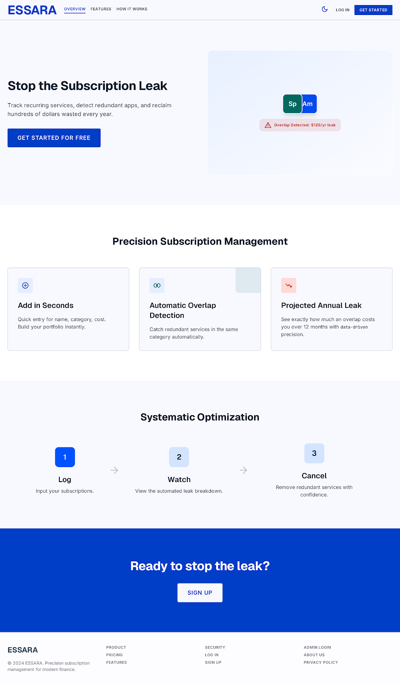
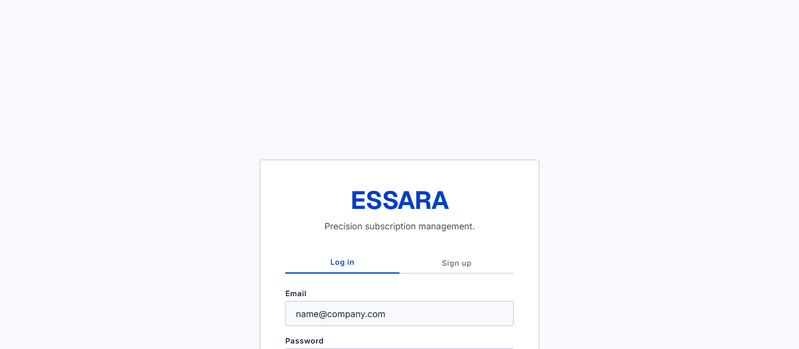
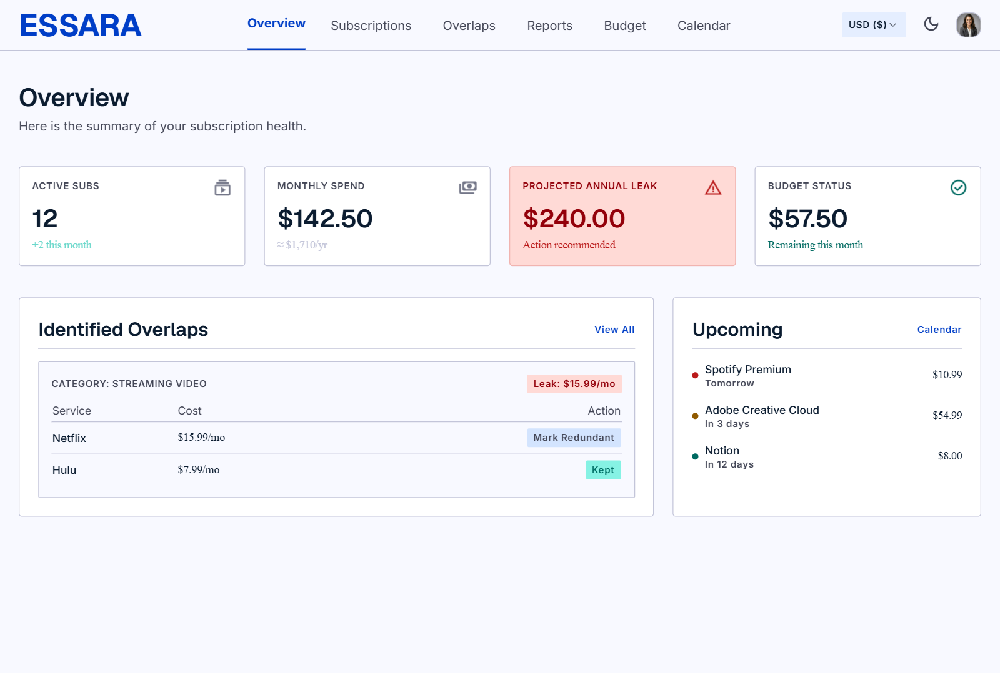
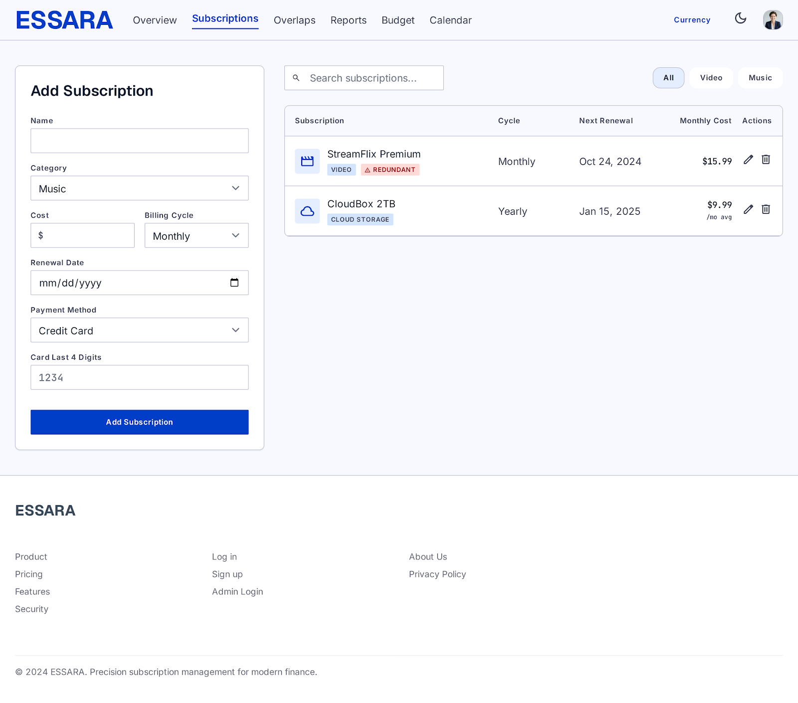
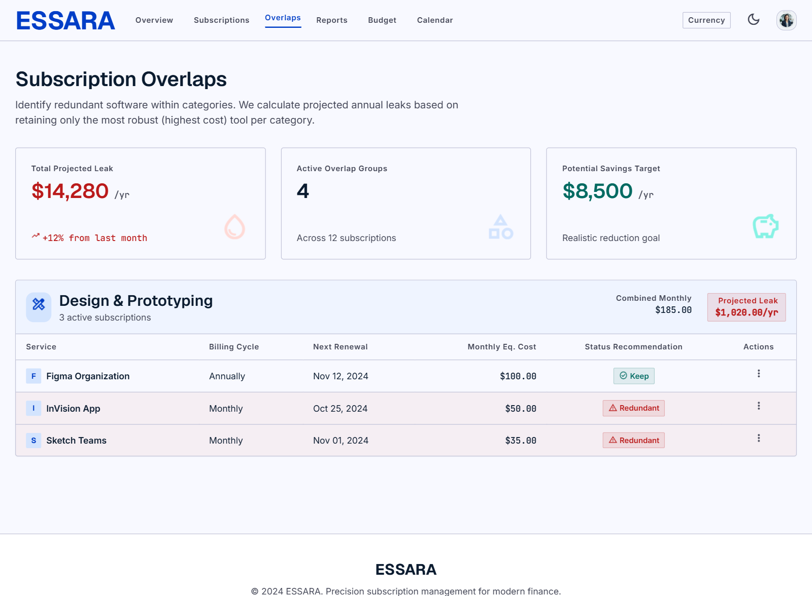
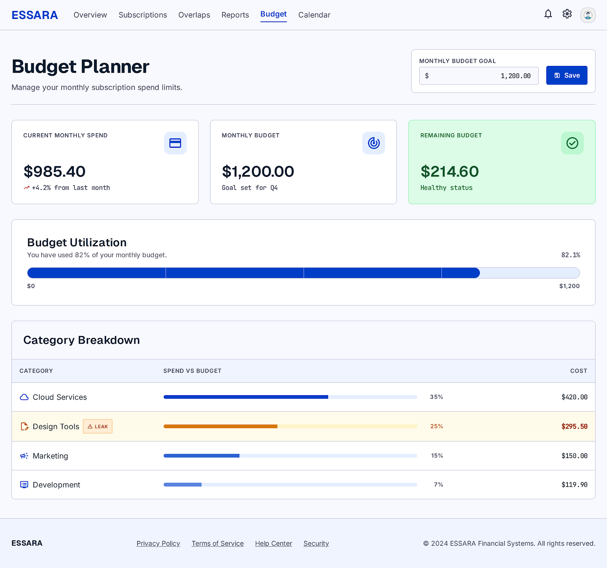
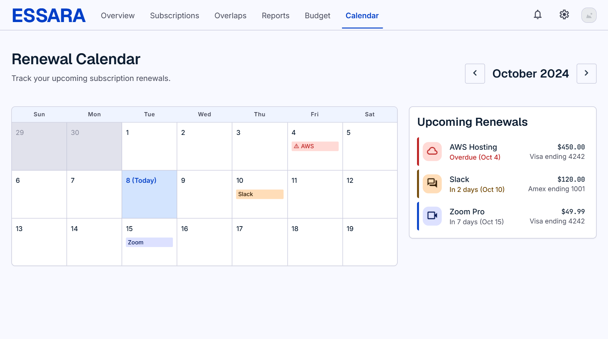
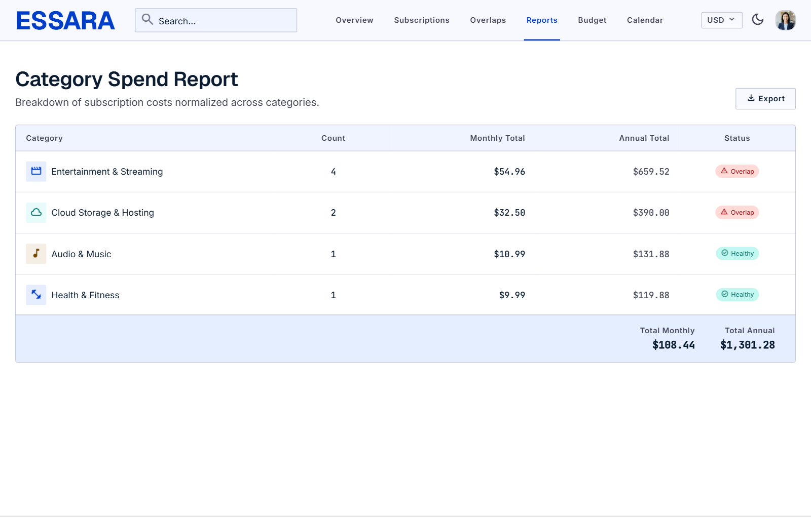

# 🔍 Subscription Leak Detector

A comprehensive web application designed to help users track their recurring expenses, manage budgets, and identify wasted money on overlapping or forgotten subscriptions. 

## 🚀 Project Overview

Managing multiple subscriptions across streaming, software, and utilities can quickly become overwhelming. The **Subscription Leak Detector** provides a centralized dashboard to monitor all active services, alert you of upcoming renewals, and visually map out your monthly budget. By highlighting "subscription overlaps," this tool acts as a financial auditor to plug the leaks in your monthly spending.

## 📸 Application Interface

Here is a look at the core interfaces of the application:

### Landing & Login



### User Dashboard
Get a quick overview of total spending and active subscriptions.


### Subscription Management & Overlaps
Track individual services and automatically flag redundant subscriptions.



### Budgeting & Reports
Visually map out your monthly limits, view financial breakdowns, and track when charges will hit your account.




## ✨ Key Features

* **Interactive Dashboard:** A main hub providing a quick overview of total spending and active subscriptions.
* **Overlap Detection:** Automatically flags redundant or overlapping services (e.g., paying for two similar music streaming apps)[cite: 1].
* **Renewal Calendar:** A dedicated calendar view to track exactly when charges will hit your account[cite: 1].
* **Budget Planner:** Built-in tools to allocate funds and ensure subscription costs do not exceed your monthly limits[cite: 1].
* **Detailed Reports:** Generates financial breakdowns and visual reports of your spending habits[cite: 1].

## 🛠️ Tech Stack

This project is built using a lightweight, native web stack without the need for heavy frameworks[cite: 1]:
* **Structure:** HTML5[cite: 1]
* **Styling:** CSS3 (Custom modular stylesheets for each feature)[cite: 1]
* **Interactivity:** Vanilla JavaScript[cite: 1]

## 📂 Repository Structure

The project is modularly organized to separate core features and their respective assets[cite: 1]:

```text
Subscription-Leak-Detector/
│
├── index.html            # Main landing page
├── login.html            # User authentication interface
├── dashboard 2/          # Core user dashboard views and logic
├── budget.html           # Budget planner interface
├── calendar.html         # Renewal calendar view
│
├── overlaps/             # Overlap detection logic and UI
│   ├── index.html
│   ├── css/style.css
│   └── js/script.js
│
├── reports/              # Financial reporting module
│   ├── reports.html
│   ├── css/style.css
│   └── js/script.js
│
├── subscription/         # Subscription entry and management
│   ├── subscription.html
│   ├── css/style.css
│   └── js/script.js
│
├── css/                  # Global stylesheets
├── js/                   # Global scripts
└── design/               # UI/UX documentation, design specs, and wireframes
